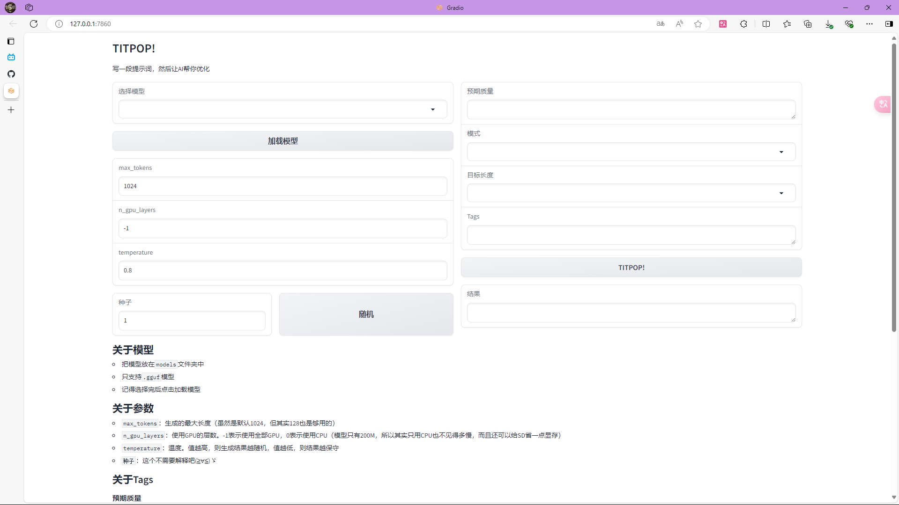

# TITPOP GUI

[SEE ENGLISH VERSION](README-en.md)



## 琥珀青葉大佬的`TITPOP`的 GUI 版本

要查看`TITPOP`
的模型权重，前往镜像站：[200M](https://hf-mirror.com/KBlueLeaf/TIPO-200M)、[500M](https://hf-mirror.com/KBlueLeaf/TIPO-500M)、[GGUF(QuantFactory)](https://hf-mirror.com/QuantFactory/TIPO-500M-GGUF)  
或者有能力的可以直接去原站点：[200M](https://huggingface.co/KBlueLeaf/TIPO-200M)、[500M](https://huggingface.co/KBlueLeaf/TIPO-500M)、[GGUF(QuantFactory)](https://huggingface.co/QuantFactory/TIPO-500M-GGUF)  
[琥珀佬的Github主页](https://github.com/KohakuBlueleaf)

感谢[ GLM4 ](https://chatglm.cn/main/alltoolsdetail?lang=zh)提供的一部分代码（技术太菜了，所以不得不用一下 AI ）

## 依赖

llama-cpp-python 要 GPU 版的，我不知道 CPU 版本是否支持`n_gpu_layers`这个参数，我也没用过 CPU 版，保险起见还是用 GPU 的吧

```
llama-cpp-python
gradio
pyperclip
```

## 使用方法

1. 去前面提到的模型权重那里下载`.gguf`文件，放进脚本所在目录下的`models`文件夹里
2. 双击脚本，或者用`cmd`运行`python GUI.py`
3. 前往“设置”页面，选择你的模型文件，然后点击加载
4. 如果看不懂参数，你有两个选择：别动参数，或者去“教程”页面看解释
5. 看到下面的生成设置，和上面一样，两个选择
6. 转到“生成”页面，选好模式、长度，写好提示词、质量，然后点“TITPOP!”就行了
7. 点“复制到剪贴板”，复制结果

## 本地化

- 使用`Language Config Manager.py`来管理语言配置
- 要添加语言，遵循以下步骤：
    1. 在`Locales`文件夹里创建一个新的`.json`文件
    2. 通常来说，我建议你复制已经存在的语言文件，然后进行翻译，翻译完成后保存文件
    3. 在`Tutorials`子文件夹新建一个`.md`文件
    4. 复制已经存在的教程文件，翻译并保存
    5. 打开`Language Config Manager.py`，选择`2. Write new language config`，你应该能够看到你的语言文件的文件名出现在了选项里
    6. 选择你的文件，重新启动 Webui，你应该能够看到语言设置生效

---

以及，谁知道脚本里的`aspect_ratio`这个参数是个啥，我自己都没搞懂（  
直接双击脚本闪退的话可以试一下在`cmd`里用`python GUI.py`，总之就是我也不知道为什么，这玩意我也是现学的