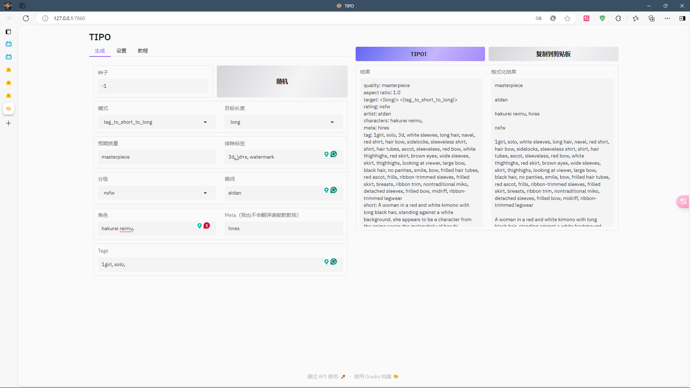

# TITPOP GUI



## 琥珀青叶（繁体字不会打）大佬的`TITPOP`的 GUI 版本

要查看`TITPOP`的模型权重，前往：[TITPOP（镜像站）](https://hf-mirror.com/KBlueLeaf/TITPOP-200M-dev)

或者有能力的可以直接去[huggingface的原站点](https://huggingface.co/KBlueLeaf/TITPOP-200M-dev)看看

[琥珀佬的Github主页](https://github.com/KohakuBlueleaf)

## 使用方法

1. 去前面提到的模型权重那里下载`.gguf`文件，放进脚本所在目录下的`models`文件夹里
2. 双击脚本，或者用`cmd`运行`python GUI.py`
3. 前往“设置”页面，选择你的模型文件，然后点击加载
4. 如果看不懂参数，你有两个选择：别动参数，或者去“教程”页面看解释
5. 看到下面的生成设置，和上面一样，两个选择
6. 转到“生成”页面，选好模式、长度，写好提示词、质量，然后点“TITPOP!”就行了
7. 点“复制到剪贴板”，复制结果

## 依赖
llama-cpp-python 要 GPU 版的
```
llama-cpp-python
gradio
pyperclip
```

---

以及，谁知道脚本里的`aspect_ratio`这个参数是个啥，我自己都没搞懂（  
直接双击脚本闪退的话可以试一下在`cmd`里用`python GUI.py`，总之就是我也不知道为什么，这玩意我也是现学的